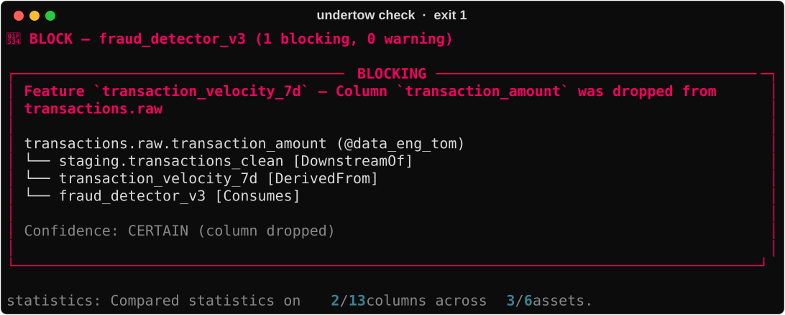

# Undertow

[](https://github.com/danielamodu/Undertow/actions/workflows/ci.yml)
[](LICENSE)
[](pyproject.toml)

> Stop deploying models on broken data.

Undertow is an agent that stands between a production ML model and a bad deploy.

It walks DataHub's graph from an `mlModel` back through its features and staging layers to the raw tables underneath, investigates what changed since the last approved deploy, and names the engineer whose change caused it. When something breaks, it blocks the deploy in CI and writes native assertions, tags, and structured risk properties back into the catalog — so the next run, on any machine, starts from what the last one learned.



**The agent gathers the context. The rules decide.** An investigation loop reads each finding, picks a DataHub tool, and goes looking — what SQL actually reads this column, was the change documented, which other models sit on this path. What it learns is attached to the report. What it cannot do is change the verdict, and that is enforced by the type system rather than by a prompt: the loop consumes and produces `Finding`, and a `Finding` has no severity field. There is a test asserting the verdict is byte-identical with and without the agent running.

That split is the whole design. An agent free to argue its way to a green light is not a gate; a gate with no agent leaves an engineer holding a diff and no context. This is both.

It is stateless by design. DataHub is the source of truth for topology and the store for verdict history; the only local artifact is a baseline snapshot, and that is mirrored into DataHub too.

---

## The Problem

Production ML models silently degrade when upstream data contracts shift without notice. A column is dropped in a Snowflake staging table, an upstream engineer relaxes nullability, or a feature mean shifts by 3σ — yet the model continues serving predictions without error. Data engineers don't know which models depend on their schemas, and ML engineers don't discover the failure until model accuracy plunges in production.

---

## What DataHub already does, and what this adds

**DataHub already does impact analysis.** Open any dataset in the UI and you can see what sits downstream of it, models included; DataHub Cloud markets this directly. Undertow does not claim to have invented downstream traversal, and it would be a worse project if it pretended the graph wasn't already there — the graph *is* the reason this works at all.

Three things are added on top of it:

1. **A diff against an approved baseline, not a view of the present.** Impact analysis answers "what is downstream of this?" Undertow answers "what changed since the last deploy this model was approved on, and does any of it reach the model?" That requires storing an approved state and comparing to it — which is why `undertow_baseline` is written back into the catalog.
2. **A schema change and a drift signal, joined on the same lineage path.** A dropped column and a 3σ mean shift are both upstream facts about the same asset, and they are graded differently on purpose: schema changes are `CERTAIN` and may block, statistical drift is `PROBABLE` and may not, unless a team opts in.
3. **A verdict with an exit code, in CI, before the deploy.** A dashboard is something you visit after you have been paged. Undertow is a gate that stops the deploy and names the engineer whose change caused it — then writes the result back so the catalog is better off for the run.

If you only need "what's downstream of this table", use DataHub's impact analysis. Undertow is for the case where you want that answer to *stop a deploy*.

---

## How It Works

Undertow walks the chain the *Production ML Agents* challenge describes — training data to features to models to deployments — and stops a deploy at the end of it.

```
transactions.raw                                   (@data_eng_tom)
└── staging.transactions_clean                     [DownstreamOf]
    ├── transaction_velocity_7d                    [DerivedFrom]
    │   └── fraud_detector_v3     (@ml_eng_alex)   [Consumes]
    │       └── deployment: fraud_detector_prod
    └── customer_txn_volume                        [DerivedFrom]
        └── churn_predictor_v1    (@ml_eng_priya)  [Consumes]
```

- **Lineage Traversal**: Resolves the full upstream footprint of an `mlModel` across ML relationships (`mlModel --Consumes--> mlFeature --DerivedFrom--> dataset`) *and* multi-hop dataset lineage, so a change in a raw table is still found through the staging layer that sits between it and the feature.
- **The fixture's lineage is parsed from SQL, not hand-written.** `staging.transactions_clean` is defined by [one SQL file](scripts/sql/staging_transactions_clean.sql), and both its schema and its column-level lineage are produced by running DataHub's own parser over it — the same `sqlglot_lineage` the Snowflake and BigQuery connectors use. The `transaction_amount → amount` edge the demo turns on exists because `CAST(transaction_amount AS DECIMAL(10, 2)) AS amount` was parsed, not because someone typed the edge in to make the demo work.
- **Blast Radius**: One dropped column reaches every model downstream of it, not just the one you happened to be deploying. Above, a single change to `transactions.raw` blocks two models owned by two teams who have never spoken.
- **Multi-Aspect Drift Detection**: Compares live graph metadata against an approved baseline for schema changes, governance shifts, and statistical drift.
- **Root-Cause Attribution**: Walks findings back to root-cause assets and resolves technical owners so the right engineer is named on the failure.
- **Native DataHub Write-Back**: Emits native `assertionInfo` + `assertionRunEvent`, risk tags (`undertow:blocked`/`cleared`), and `structuredProperties` back into the catalog.

---

## Try it in 60 seconds, without DataHub

```bash
git clone https://github.com/danielamodu/Undertow.git && cd Undertow
pip install -e ".[dev]"
undertow demo
```

Works from any directory once installed, on Windows, macOS or Linux — no `make`, no shell assumptions.

That runs the whole gate — CLEAR on the approved graph, then a dropped column, then BLOCK on two models owned by two different teams — with no Docker, no DataHub, and no API key.

It replays a graph **recorded from a live DataHub OSS v1.7.0** by [`scripts/record_fixture.py`](scripts/record_fixture.py): every entity, edge, schema and profile the resolver was given, captured and handed back. The differs, attribution, policy engine, reporter and exit codes are the same code a live run uses, on the same data. What it does *not* exercise is the resolver's ability to talk to DataHub — that needs `--mcp` or the SDK path against a real instance, which is what CI and `make demo` do. The command says so on every run.

Also available without standing anything up:

- **[`examples/`](examples/)** — real captured output for every scenario: CLEAR, WARN on drift, BLOCK, the governance case, the two-model blast radius, the pre-merge PR comment, and the aspects written to DataHub **read back out of GMS** to prove they landed.
- The test suite, which needs no DataHub and no API key: `pytest -q`

---

## Quick Start

### Prerequisites
- Python 3.11+ — the floor is set by `mcp-server-datahub`, which the `--mcp` path needs
- Docker Desktop
- DataHub OSS (verified against v1.7.0)

### Setup
```bash
git clone https://github.com/danielamodu/Undertow.git
cd Undertow
pip install -e ".[dev]"
datahub docker quickstart
make seed
make baseline
```

`.[dev]` installs everything every documented command needs, including the MCP client
and server for `--mcp` and the Anthropic SDK for `--investigate`. If you want a leaner
install, the extras are `.[mcp]` and `.[llm]`; the core package resolves lineage through
the Python SDK and needs neither.

---

## Demo

Drop a column from an upstream table, then ask both models whether they still stand:

```bash
# Drop transaction_amount from transactions.raw
make break

# Check every model downstream of it
make blast-radius
```

### Output

Verbatim from a live run against DataHub v1.7.0:

```
🔴 BLOCK — fraud_detector_v3 (1 blocking, 0 warning)

┌────────────────────────────────────── BLOCKING ───────────────────────────────────────┐
│ Feature `transaction_velocity_7d` — Column `transaction_amount` was dropped from      │
│ transactions.raw                                                                      │
│                                                                                       │
│ transactions.raw.transaction_amount (@data_eng_tom)                                   │
│ └── staging.transactions_clean [DownstreamOf]                                         │
│     └── transaction_velocity_7d [DerivedFrom]                                         │
│         └── fraud_detector_v3 [Consumes]                                              │
│                                                                                       │
│   Confidence: CERTAIN (column dropped)                                                │
│                                                                                       │
└───────────────────────────────────────────────────────────────────────────────────────┘

exit: 1

🔴 BLOCK — churn_predictor_v1 (1 blocking, 0 warning)

┌────────────────────────────────────── BLOCKING ───────────────────────────────────────┐
│ Feature `customer_txn_volume` — Column `transaction_amount` was dropped from          │
│ transactions.raw                                                                      │
│                                                                                       │
│ transactions.raw.transaction_amount (@data_eng_tom)                                   │
│ └── staging.transactions_clean [DownstreamOf]                                         │
│     └── customer_txn_volume [DerivedFrom]                                             │
│         └── churn_predictor_v1 [Consumes]                                             │
│                                                                                       │
│   Confidence: CERTAIN (column dropped)                                                │
│                                                                                       │
└───────────────────────────────────────────────────────────────────────────────────────┘

exit: 1
```

The fraud team's change broke the churn team's model. Neither team knew the other was downstream of the same table; the graph did.

Both runs exit `1`. Captured verbatim in [`examples/verdict-blast-radius.txt`](examples/verdict-blast-radius.txt).

Add `--write-back` to record the verdict in DataHub:

```bash
make check-write
```

```
✍ Written to DataHub → fraud_detector_v3
```

To restore the baseline graph at any time:
```bash
make reset
```

### Commands

Windows does not ship `make`, so every target below also exists as
`.\demo.ps1 <target>` — same names, no install. Run `.\demo.ps1 help` for the list.

| Command | What it does |
|---|---|
| `make seed` | Build the fixture graph: source tables, SQL-parsed staging layer, features, two models, model group, deployment |
| `make baseline` | Capture the approved state of both models |
| `make break` | Drop `transaction_amount` from `transactions.raw` — a `CERTAIN` change |
| `make break-stats` | Shift the distribution of `amount` by 4.8σ — a `PROBABLE` change |
| `make break-governance` | Deprecate the raw table and tag staging as PII |
| `make check-warn` | Gate after drift: WARN, exit `0`. Statistics do not stop a deploy |
| `make check` | Gate the fraud model |
| `undertow check --all` | Gate every model in the `models:` inventory |
| `make blast-radius` | Gate every model downstream of the change |
| `make check-write` | Gate and write the verdict back to DataHub |
| `make impact` | Check a proposed SQL change *before it merges* |
| `make history` | Every recorded verdict, read back out of DataHub |
| `make check-mcp` | Resolve lineage through the DataHub **MCP server** instead of the SDK |
| `make check-investigate` | Add the agent investigation loop (needs `--mcp` and `ANTHROPIC_API_KEY`) |
| `make reset` | Restore the graph |

### Exit codes

Undertow is a CI gate, so its exit status is part of its contract:

| Code | Meaning |
|---|---|
| `0` | CLEAR — proceed. Also WARN, unless `--fail-on-warn` |
| `1` | BLOCK — the gate ran and said stop |
| `2` | ERROR — the gate could **not** produce a verdict |

`1` and `2` are deliberately distinct. A pipeline needs to tell "your upstream broke" from "Undertow broke", and those demand different responses. Undertow fails closed: if it cannot reach DataHub, it exits `2` rather than reporting a green light it never actually earned.

---

## Architecture

Six decoupled layers. The LLM sits off to the side of the decision, never in it:

```
  model URN
      │
      ▼
┌───────────┐   ┌──────────┐   ┌────────────┐   ┌───────────────┐
│ RESOLVER  │──▶│  DIFFER  │──▶│ ATTRIBUTOR │──▶│ POLICY ENGINE │
│ walk the  │   │ schema ∙ │   │ root cause │   │   verdict     │
│   graph   │   │  stats   │   │  + owners  │   │  + exit code  │
└─────┬─────┘   └──────────┘   └────────────┘   └───────┬───────┘
      │                                                 │
      │ MCP / SDK                    ┌──────────────────┴────────┐
      │                              ▼                           ▼
      │                     ┌─────────────────┐        ┌──────────────────┐
      │                     │  INVESTIGATOR   │        │    NARRATOR      │
      │                     │  agent loop —   │        │ prose, or a      │
      │                     │  adds context,  │        │ template. Never  │
      │                     │  never severity │        │ decides anything │
      │                     └────────┬────────┘        └────────┬─────────┘
      │                              └─────────────┬────────────┘
      │                                            ▼
      │                                    ┌───────────────┐
      │                                    │   REPORTER    │
      │                                    │ console ∙ PR  │
      │                                    │ ∙ write-back  │
      │                                    └───────┬───────┘
      ▼                                            │
┌──────────────────────────────────────────────────▼──────────┐
│                          DATAHUB                            │
│  reads: MCP server (get_entities, get_lineage, schema)      │
│  writes: REST emitter (assertions, tags, structured props)  │
└─────────────────────────────────────────────────────────────┘
```

1. **Resolver**: Traverses the graph via DataHub's MCP server (or a fallback Python SDK client) to construct `DependencyFootprint` snapshots.
2. **Differ**: Evaluates set differences across schema, governance, and statistical profiles.
3. **Attributor**: Attaches origin-to-leaf `AttributionPath` chains and resolves technical owners.
4. **Policy Engine**: Evaluates rule severity deterministically against `undertow.yaml` rules and exemptions.
5. **Narrator**: Bounded LLM prose generator (`claude-sonnet-4-6`) with Jinja2 template fallback & URN hallucination validation.
6. **Reporter**: Rich console boxed tree renderer, GitHub Actions PR Markdown reporter, and DataHub REST emitter write-back.

### Key Architectural Guarantees

- **Deterministic Core**: No LLM sits in the blocking path. Rules evaluate deterministically, so the same graph and the same baseline always produce the same verdict.
- **The agent cannot change the verdict.** When `--investigate` is on, the investigation loop runs *after* the policy engine has decided, and it can only add explanation. This is enforced structurally rather than by instruction, and there is a test that asserts the verdict is byte-identical with and without the agent.
- **Fails closed.** A resolver that cannot reach DataHub records the failure instead of returning an empty footprint. An empty footprint would otherwise diff clean against any baseline and surface as a confident CLEAR produced by a broken connection.
- **Statistics limited to what DataHub profiles by default**: null-rate jumps, cardinality shifts, z-score mean shifts, range violations, and row-count changes — all from fields that are `default=True` on a stock instance. An earlier revision computed PSI from quantiles and histograms; it was removed because DataHub gates quantiles behind three separate `default=False` flags *and* a cardinality check, so it worked on our fixture and returned nothing on anyone else's DataHub.
- **A missing statistic means "cannot assess", never "no drift."** Every report ends with what the statistical differ could actually see:

  ```
  statistics: Compared statistics on 3/14 columns across 3/6 assets.
  ```

  "No drift found" across assets that were never profiled is a far weaker claim than the same words across assets that were, and a report that renders them identically is quietly misleading. Where nothing was profiled at all, the line turns yellow and says so.

  Profiles are read from DataHub's *timeseries* API rather than the entity snapshot, because that is the only place they exist — `datasetProfile` never appears in `get_entity_semityped`. Missing that is what left the statistical differ fully implemented, fully unit-tested, and connected to nothing.
- **CERTAIN vs. PROBABLE**: Schema and governance changes are `CERTAIN`. Statistical drift is `PROBABLE`, and the policy engine refuses to let a PROBABLE finding BLOCK unless a team explicitly opts in — a distribution moving is evidence something *may* be wrong, and blocking on evidence that weak is how a gate loses its welcome.
- **Native Write-Back**: Standard DataHub metadata change proposals. No custom datastore.

---

## DataHub Skill

[`skills/undertow-deploy-gate/`](skills/undertow-deploy-gate/) is a DataHub Skill, written to the [datahub-skills](https://github.com/datahub-project/datahub-skills) format so it installs and dispatches like the ones DataHub ships.

The MCP server gives an agent tools. A skill gives it judgement about when to use them. This one encodes the workflow around the gate — resolve the model, confirm a baseline exists, run the check, read the *exit code* rather than the prose, and on a block, name the column, the path, and the owner before checking who else is downstream.

The part worth reading is what it forbids:

> **You do not decide whether the deploy proceeds. Undertow does.**
>
> If you find yourself looking for a flag that makes the red box go away, stop and tell the user what the finding actually is.

It will not edit `undertow.yaml` to downgrade a BLOCK, re-baseline to make a finding disappear without confirmation, or report exit code `2` — the gate could not see the graph — as a pass. The same constraint the investigation loop has in code, written down for the agent that drives the CLI.

```
/undertow-deploy-gate is fraud_detector_v3 safe to deploy?
/undertow-deploy-gate what breaks if I drop transaction_amount from transactions.raw?
```

Ships with [`references/verdicts.md`](skills/undertow-deploy-gate/references/verdicts.md) (every finding kind, its confidence, its severity) and [`templates/owner-notification.md`](skills/undertow-deploy-gate/templates/owner-notification.md). Both are tested: [`tests/test_skill.py`](tests/test_skill.py) asserts every CLI subcommand and flag the skill names actually exists, and that the finding-kind reference matches the enum the policy engine rules on. A skill is documentation an agent *executes*, so a stale command in one gets run rather than merely misread.

---

## DataHub Integration

Undertow holds no database of its own. DataHub is the source of truth for topology *and* the store for verdict history — including the baseline, which means a wiped CI runner can still tell you what changed since the last approved deploy.

- **Graph Traversal via the Agent Context Kit's MCP Server**: A real MCP client (`--mcp`) spawns the DataHub MCP server over stdio, keeps one initialised session alive for the whole run, and calls `get_entities`, `get_lineage`, and `list_schema_fields`. That server is the Agent Context Kit's primary surface — the kit ships as `datahub-agent-context`, whose `mcp_tools/` are the same tools this client calls, alongside LangChain and Google ADK adapters for agents built on those frameworks. Undertow speaks the protocol directly, so it needs neither. Tool names are checked against the server's own `tools/list` at connect time, so a signature drift fails loudly instead of silently resolving to nothing.

  Verified against mcp-server-datahub 0.6.0 on DataHub OSS v1.7.0, which advertises **six** read-only tools: `get_entities`, `get_lineage`, `get_lineage_paths_between`, `list_schema_fields`, `search`, and `get_dataset_queries`. `search_documents` and `grep_documents` are documented but absent from that handshake, which is why the investigation loop intersects its tool list with `available_tools` rather than trusting a compile-time constant — offering a model a tool that does not exist costs a turn and teaches it nothing.
- **SDK fallback**: `SdkLineageSource` covers environments without the MCP server. Both paths resolve the same graph and produce the same verdict.
- **Write-Back Metadata**:
  - `assertionInfo` (CUSTOM / EXTERNAL) & `assertionRunEvent` (SUCCESS / FAILURE) on root cause datasets.
  - `globalTags`: `undertow:blocked` and `undertow:cleared` on `mlModel`.
  - `structuredProperties`: `undertow_risk_verdict`, `undertow_last_checked`, and `undertow_baseline` snapshots on `mlModel`.
  - `institutionalMemory`: Audit links back to GitHub PRs and execution runs.

  Write-back goes through the REST emitter rather than the MCP server because the OSS build of `mcp-server-datahub` gates its mutation, data-quality, and user tools off — the server logs `Mutation Tools DISABLED` on startup. Reads come from MCP; writes take the path that actually exists.

### Composing with other agents

Undertow writes verdicts into the catalog rather than into a store of its own, which means the next agent to read that catalog inherits them without integrating with Undertow at all.

DataHub's [Analytics Agent](https://datahub.com/blog/datahub-analytics-agent/) reads documentation and context before it writes SQL. After an Undertow run, a model carries an `undertow:blocked` tag, an `undertow_risk_verdict` structured property, and a native assertion whose run history says how long it has been failing. An analyst asking that agent about the model gets an answer shaped by all of it.

That is the argument for a context platform working, and it is why Undertow writes back in native aspects rather than inventing its own: the two agents were never built to talk to each other, and they do not have to.

---

## OSS Contribution

**`MLModelPatchBuilder` for `datahub/specific/`**

- **Upstream PR: [datahub-project/datahub#18979](https://github.com/datahub-project/datahub/pull/18979)** — builder + 13 tests, against `master`
- Issue it closes: [datahub-project/datahub#18971](https://github.com/datahub-project/datahub/issues/18971)
- The same code, vendored here so Undertow runs today: [`contrib/datahub-mlmodel-patch-builder/`](contrib/datahub-mlmodel-patch-builder/)

DataHub's `entity_client.update()` branches on its argument: an `Entity` becomes a full-aspect `UPSERT`, a `MetadataPatchProposal` becomes a surgical `PATCH`. `datahub/specific/` ships patch builders for chart, dashboard, dataJob, dataProduct, dataset, form, and structuredProperty — but none for an ML entity, so `mlModel` aspects are `UPSERT`-only unless you hand-roll one.

That matters because `UPSERT` is lossy. Verified against a live GMS:

| Write path | Result |
|---|---|
| Two independent `PATCH` writes | Both properties survive |
| One full-aspect `UPSERT` | The property the writer didn't know about is destroyed |

Undertow writes `undertow_risk_verdict`, `undertow_last_checked`, and `undertow_baseline` as separate concerns, so this is a live problem rather than a theoretical one.

The evidence is in [`examples/datahub-writeback.json`](examples/datahub-writeback.json): a `probe_alpha` property written by something else is still on the model after Undertow wrote three properties of its own. An `UPSERT` would have removed it.

The proposed builder composes DataHub's existing entity-agnostic mixins (`HasOwnershipPatch`, `HasTagsPatch`, `HasStructuredPropertiesPatch`, …) exactly as `DataProductPatchBuilder` does — no new machinery, just the missing composition. It ships with a 13-test suite that runs without DataHub:

```bash
pytest contrib/datahub-mlmodel-patch-builder/ -q
```

*Note: `datahub.sdk.MLModel` already supports mlModel structured properties via the newer SDK layer. The gap is specifically the absence of a `PATCH`-emitting builder, not the absence of mlModel support.*

---

## Prior Art & Research

Two 2025 papers by Leest et al. frame the gap Undertow occupies:

- **[arXiv:2510.24142](https://arxiv.org/abs/2510.24142)** — *Monitoring and Observability of Machine Learning Systems: Current Practices and Gaps.* Seven focus groups with practitioners; documents how teams validate models, detect faults, and explain degradations, and where that practice falls short.
- **[arXiv:2510.23528](https://arxiv.org/abs/2510.23528)** — *Tracing Distribution Shifts with Causal System Maps.* Proposes making the propagation paths between environment and ML internals explicit so distribution shifts can be attributed rather than merely detected. Explicitly work-in-progress: an approach and research agenda, not an implementation.

Undertow implements that attribution framing against a lineage graph that already exists in production — DataHub — and makes the result a blocking pre-deploy gate.

---

## Using this on your own models

The demo is a fixture. Here is what adopting it looks like.

**You need DataHub with ML lineage already ingested** — your warehouse or dbt for the tables, your model registry for `mlModel` and `mlFeature`. Undertow reads that graph; it does not ingest anything itself.

**1. Find the model and approve today's state.**

```bash
datahub search "fraud_detector" -f entity_type=mlModel --urns-only
undertow baseline --model "<that URN>"
```

The baseline says *this model is healthy on this data, now*. It is stored in DataHub, not on disk, so every CI runner shares one answer.

**2. List the models your team gates**, in `undertow.yaml`:

```yaml
models:
  - "urn:li:mlModel:(urn:li:dataPlatform:sagemaker,fraud_detector_v3,PROD)"
  - "urn:li:mlModel:(urn:li:dataPlatform:sagemaker,churn_predictor_v1,PROD)"
```

`undertow check --all` sweeps them and exits with the worst outcome. A model somebody forgot to add is then visible in a reviewed file, rather than a gap nobody notices until the gate turns out to cover three models out of twelve.

**3. Add it to the pipeline that deploys the model.**

```yaml
- uses: danielamodu/Undertow@main
  with:
    model: ${{ vars.MODEL_URN }}
    datahub-url: ${{ secrets.DATAHUB_GMS_URL }}
    datahub-token: ${{ secrets.DATAHUB_GMS_TOKEN }}
```

From then on, a PR that retrains or redeploys that model passes silently on a clean upstream, and is blocked with the path and the owning engineer named when it isn't.

**4. When a change was intentional**, re-baseline deliberately — `undertow baseline --model …` is an explicit act with a name against it, not a flag that suppresses the warning.

**5. Optionally, in the repo that holds your dbt or warehouse SQL**, add [`upstream-pr-gate.yml`](.github/workflows/upstream-pr-gate.yml). The engineer removing the column then finds out on their own pull request that two models depend on it — which prevents the incident rather than catching it.

**6. Tune [`undertow.yaml`](undertow.yaml)** — severity per finding kind, thresholds, and exemptions that must carry an expiry date.

### What it needs from you, honestly

- **Lineage in DataHub.** No column-level lineage means findings degrade from "this column" to "this table". Undertow reports what the graph supports and no more.
- **Profiling, for the statistical checks.** Most catalogs are partly profiled, which is why every report ends with how much of the footprint it could actually inspect.
- **A baseline per model.** Without one there is nothing to diff, and Undertow exits `2` rather than guessing.

The realistic first adopter is not a platform team. It is one ML engineer who has been burned by a silent upstream change, adding this to one model's pipeline so it does not happen twice.

---

## Catching it before the merge

`undertow check` runs at deploy time. By then the table has been rebuilt, the column is gone, and the ML team finds out by being blocked — while the engineer who removed it has moved on to something else.

`undertow impact` runs earlier, on the pull request that changes the SQL:

```bash
undertow impact examples/pr-drops-amount.sql
```

```
staging.transactions_clean — removes amount
    reaches churn_predictor_v1 (@ml_eng_priya)
      via customer_txn_volume → churn_predictor_v1
    reaches fraud_detector_v3 (@ml_eng_alex)
      via transaction_velocity_7d → fraud_detector_v3
```

It parses the proposed statement, compares the columns it *would* produce against the columns that table has in DataHub today, and walks downstream from anything that disappears. The result lands as a comment on the PR removing the column, addressed to the person removing it — see [`examples/github-pr-comment-upstream.md`](examples/github-pr-comment-upstream.md) and [`.github/workflows/upstream-pr-gate.yml`](.github/workflows/upstream-pr-gate.yml).

Informational by default. The check knows a column is going away; it does not know whether that is intended, and a PR check that fails on every deliberate column removal gets switched off within a week. `--fail-on-impact` makes it blocking for teams who want that.

---

## Verdict history

Undertow keeps no database. Every `--write-back` appends an `assertionRunEvent` to a native DataHub assertion, and because that is a *timeseries* aspect, runs accumulate rather than overwrite. The history is the catalog's:

```bash
undertow history --model "urn:li:mlModel:(urn:li:dataPlatform:sagemaker,fraud_detector_v3,PROD)"
```

```
              Verdict history — fraud_detector_v3
┌─────────────────────────┬─────────┬──────────┬─────────┬────────┬──────┐
│ Checked at              │ Verdict │ Blocking │ Warning │ Assets │ Exit │
├─────────────────────────┼─────────┼──────────┼─────────┼────────┼──────┤
│ 2026-08-07 21:08:14 UTC │ BLOCK   │        1 │       0 │      6 │    1 │
│ 2026-08-07 16:46:20 UTC │ BLOCK   │        1 │       0 │      6 │    1 │
│ 2026-08-06 11:18:32 UTC │ BLOCK   │        1 │       0 │      5 │    1 │
└─────────────────────────┴─────────┴──────────┴─────────┴────────┴──────┘
  11 run(s) over 1 day(s), 11 blocked.
  assertion: urn:li:assertion:c3e79c057400bc9ad701b995812a3f0d
```

A CI runner wiped between builds still knows what the last twenty deploys looked like. The assertion URN is derived from the model URN rather than stored, so the same model always appends to one series — and the same rows are visible in DataHub's own assertion timeline, since it is a native assertion rather than something Undertow invented.

---

## License

[Apache License 2.0](LICENSE)
